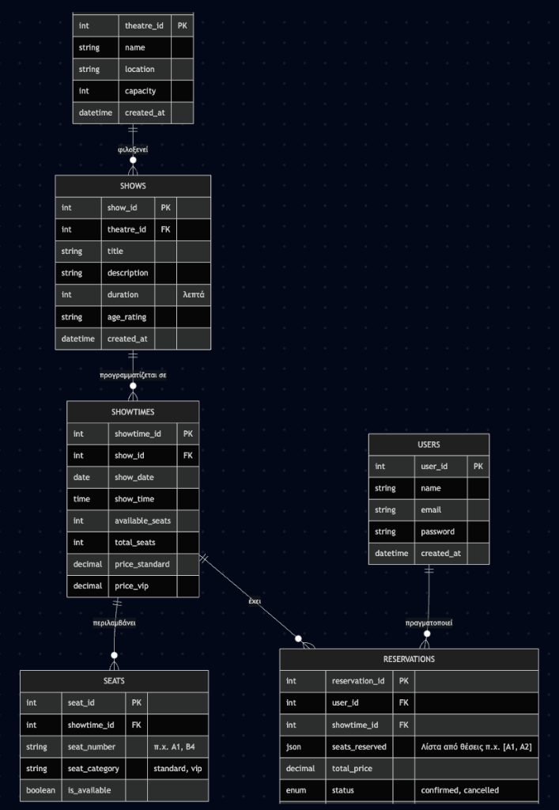
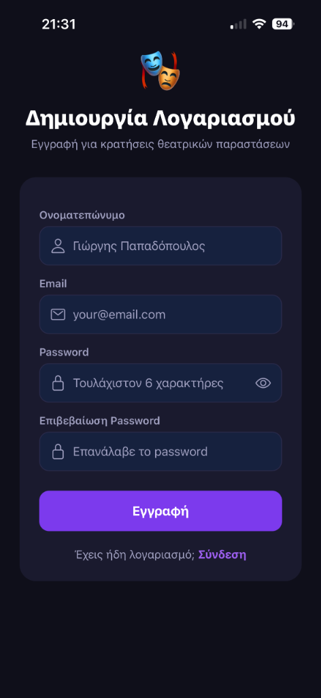
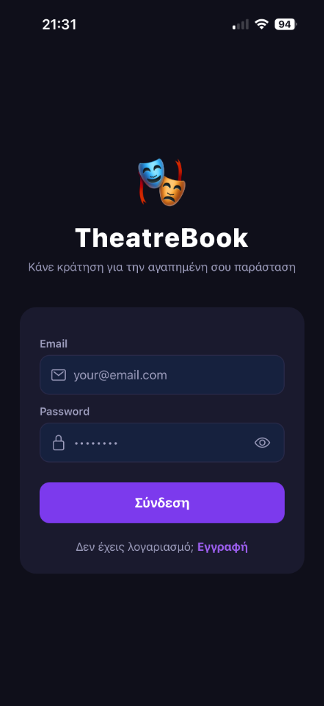
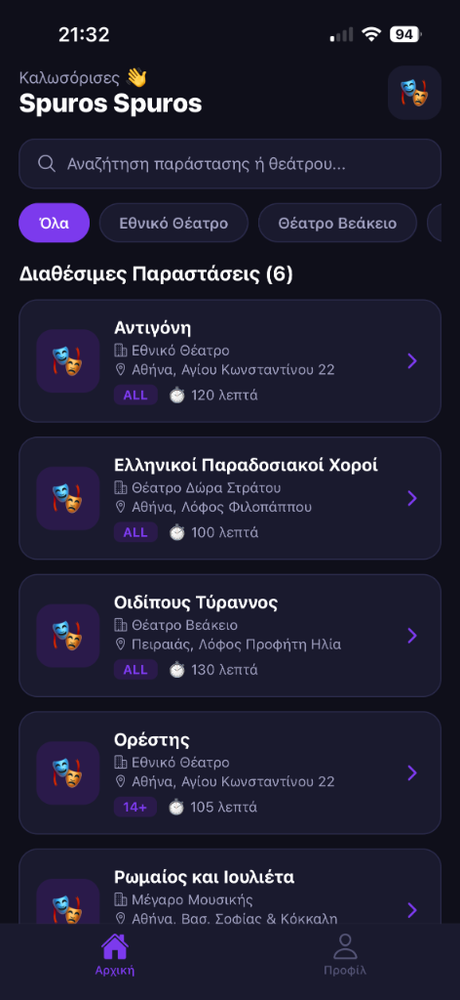
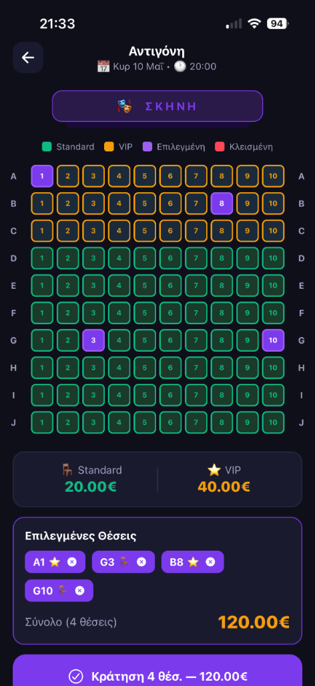
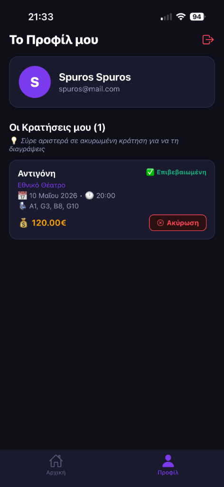
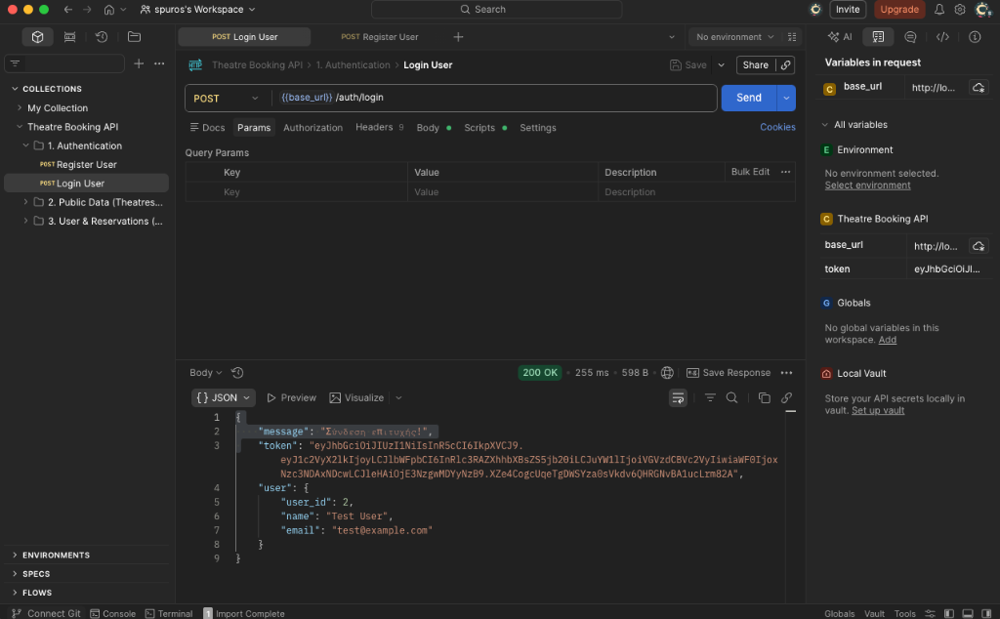
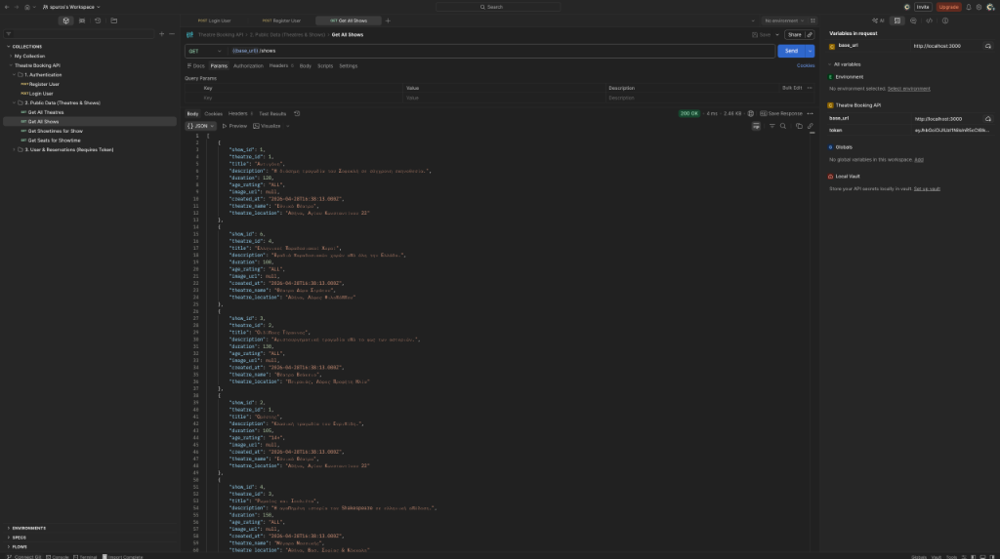
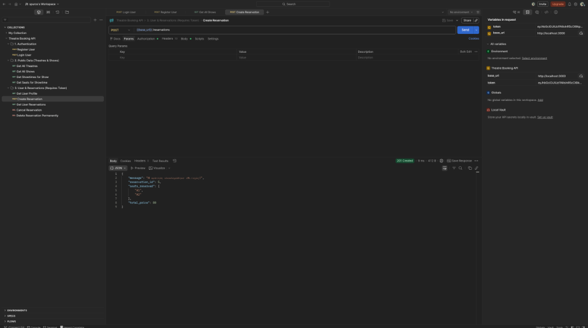

# Theatre Booking App (CN6035)

Μια full-stack mobile εφαρμογή για κράτηση θέσεων σε θεατρικές παραστάσεις, φτιαγμένη στα πλαίσια πανεπιστημιακής εργασίας (CN6035).

## Τεχνολογίες που χρησιμοποιήθηκαν

- **Frontend**: React Native, Expo, React Navigation
- **Backend**: Node.js, Express.js
- **Βάση Δεδομένων**: MariaDB
- **Ασφάλεια**: JWT (JSON Web Tokens) για Authentication, Bcrypt (Password Hashing)
- **Επικοινωνία**: Axios (με interceptors για ασφαλή HTTP requests)

## Βασικά Χαρακτηριστικά (Features)

- **Εγγραφή / Σύνδεση Χρηστών**: Ασφαλής ταυτοποίηση με JWT.
- **Προβολή Παραστάσεων**: Λίστα με διαθέσιμες παραστάσεις, με φιλτράρισμα ανά θέατρο.
- **Διαδραστικός Χάρτης Θέσεων (Seat Map)**: Επιλογή θέσεων (Standard / VIP) με έλεγχο διαθεσιμότητας σε πραγματικό χρόνο (concurrent booking lock).
- **Διαχείριση Κρατήσεων**: Προβολή ιστορικού κρατήσεων μέσα από το Προφίλ του χρήστη.
- **Ακύρωση & Διαγραφή**: Ακύρωση μελλοντικών κρατήσεων και swipe-to-delete για οριστική διαγραφή στις ακυρωμένες. 

## Σχεδιασμός Βάσης Δεδομένων (ER Diagram)


## Παρουσίαση Εφαρμογής

### 1. Εγγραφή & Σύνδεση Χρήστη



### 2. Αρχική Οθόνη (Λίστα Παραστάσεων)


### 3. Διαδραστικός Χάρτης Κρατήσεων (Seat Map)


### 4. Προφίλ Χρήστη (Διαχείριση Κρατήσεων)


## API Testing (Postman)
Η λειτουργία του Backend (REST API) έχει δοκιμαστεί επιτυχώς με το Postman: 

### 1. Ταυτοποίηση (Login)


### 2. Ανάκτηση Παραστάσεων (Get Shows)


### 3. Δημιουργία Κράτησης (Create Reservation)


---

## Οδηγίες Εγκατάστασης (Setup)

Για να τρέξει η εφαρμογή τοπικά, κάνουμε τα παρακάτω βήματα:

### 1. Βάση Δεδομένων (MAMP)
1. Ανοίγουμε το MAMP (Apache & MySQL).
2. Ανοίγουμε το phpMyAdmin (`http://localhost:8888/phpmyadmin`).
3. Δημιουργούμε μια νέα βάση με όνομα `theatre_db`.
4. Κάνουμε import το αρχείο `database.sql` που βρίσκεται στον κεντρικό φάκελο.

### 2. Backend (REST API)
Ανοίγουμε ένα τερματικό στον φάκελο `backend` και τρέχουμε:
```bash
npm install 
npm run dev
```
Το API θα τρέχει στο `http://localhost:3000`. 

### 3. Frontend (Mobile App)
Ανοίγουμε ένα δεύτερο τερματικό στον φάκελο `frontend` και τρέχουμε:
```bash
npm install 
npx expo start
```
### 4. Χρήση σε smartphone
Σκανάρετε το QR Code με την εφαρμογή **Expo Go** (Android/iOS) στο κινητό σας, με το κινητό στο ίδιο WiFi με τον υπολογιστή, αλλιώς, προφανώς, δεν θα «μιλήσουν» μεταξύ τους.
